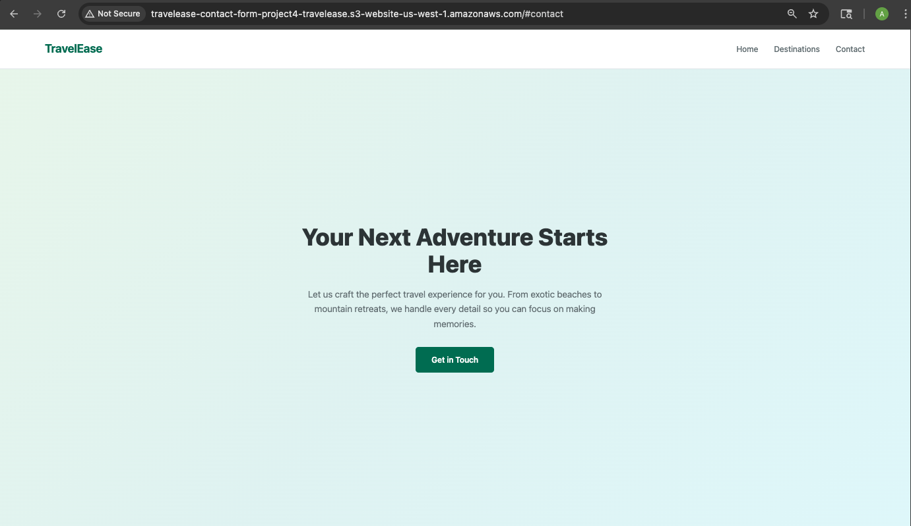
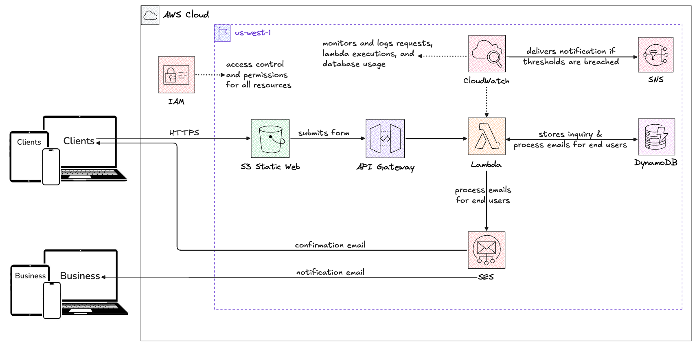

# TravelEase Serverless Contact Form

A serverless contact form solution for a travel agency, built with Terraform, AWS Lambda, API Gateway, DynamoDB, and SES. Captures customer inquiries, stores them in a database, and sends instant confirmation emails — all without managing a single server.

## Features

- 📬 **Contact Form** - Captures customer name, email, and message
- 💾 **Database Storage** - Every inquiry saved to DynamoDB with unique ID and timestamp
- ✉️ **Dual Email Notifications** - Confirmation email to customer + notification to business
- 🏗️ **Infrastructure as Code** - Entire stack defined in Terraform (19 resources)
- 🔒 **Least-Privilege Security** - IAM policies scoped to exact actions needed
- 🌐 **Static Website Hosting** - Frontend served from S3 with public access
- 💰 **Cost Optimized** - Pay-per-request pricing, virtually free at low traffic

## Demo



📝 **Read the full walkthrough:** [Project — Contact Form Site w/ AWS Lambda and more! - Medium Article](https://medium.com/@elnala24/project-contact-form-site-w-aws-lambda-and-more-3c7759f9c423)

## Architecture



```
User → S3 Static Website → API Gateway (/submit) → Lambda → DynamoDB
                                                      ↓
                                                     SES → Confirmation Email (to customer)
                                                     SES → Notification Email (to business)
```

## Tech Stack

- **Infrastructure as Code**: Terraform (HCL)
- **Cloud Provider**: AWS (us-west-1)
- **Compute**: AWS Lambda (Node.js 18.x)
- **API**: API Gateway (REST)
- **Database**: DynamoDB (on-demand)
- **Email**: SES (Simple Email Service)
- **Hosting**: S3 (static website)
- **Monitoring**: CloudWatch
- **Frontend**: HTML5, CSS3, JavaScript

## Getting Started

### Prerequisites

- AWS account with CLI configured
- Terraform installed ([Install guide](https://developer.hashicorp.com/terraform/install))
- AWS CLI installed ([Install guide](https://docs.aws.amazon.com/cli/latest/userguide/getting-started-install.html))
- A verified email address in AWS SES

### Installation

1. Clone the repository:

```bash
git clone https://github.com/elnala24/project4-travelease-contact-form.git
cd project4-travelease-contact-form
```

2. Create a `terraform.tfvars` file in the `infrastructure/` directory:

```bash
cd infrastructure
```

```hcl
sender_email   = "your-verified-email@gmail.com"
business_email = "your-verified-email@gmail.com"
```

3. Initialize and deploy the infrastructure:

```bash
terraform init
terraform plan
terraform apply
```

Type `yes` to confirm. Terraform will deploy all 19 resources.

4. Zip and deploy the Lambda function:

```bash
cd ../lambda
zip -r ../infrastructure/lambda.zip index.js
cd ../infrastructure
terraform apply
```

5. Upload the frontend to S3:

```bash
cd ../frontend
aws s3 cp index.html s3://travelease-contact-form-project4-travelease/
aws s3 cp styles.css s3://travelease-contact-form-project4-travelease/
aws s3 cp script.js s3://travelease-contact-form-project4-travelease/
```

6. Get your URLs:

```bash
cd ../infrastructure
terraform output
```

Open the `website_url` in your browser to see the contact form.

### Usage

1. Open the website URL in your browser
2. Fill in the contact form (name, email, message)
3. Click submit
4. You'll see a success message with a unique inquiry ID
5. Customer receives a confirmation email
6. Business receives a notification email with inquiry details

## AWS Services Setup

### SES Email Verification

SES starts in sandbox mode — both sender and recipient emails must be verified:

1. Go to **AWS Console → SES → Verified Identities**
2. Click **Create Identity** → Select **Email address**
3. Enter your email and click **Create Identity**
4. Check your inbox and click the verification link

**Note**: In production, you'd request SES production access and configure domain verification (SPF, DKIM) to avoid emails landing in spam.

### IAM Permissions

The Lambda function uses least-privilege IAM policies with only the specific actions needed:

- **CloudWatch**: `logs:CreateLogGroup`, `logs:CreateLogStream`, `logs:PutLogEvents`
- **DynamoDB**: `dynamodb:PutItem` (scoped to the specific table)
- **SES**: `ses:SendEmail` (scoped to all resources)

## Project Structure

```
project4-travelease-contact-form/
├── architecture/            # Architecture diagrams
├── frontend/
│   ├── index.html          # Landing page with contact form
│   ├── styles.css          # Responsive styling
│   └── script.js           # Form submission logic (POST to API Gateway)
├── infrastructure/
│   ├── main.tf             # All AWS resource definitions (19 resources)
│   ├── providers.tf        # AWS provider configuration
│   ├── variables.tf        # Variable declarations
│   ├── terraform.tfvars    # Variable values (DO NOT commit)
│   ├── outputs.tf          # Output values (website_url, api_url)
│   └── lambda.zip          # Zipped Lambda function for deployment
├── lambda/
│   └── index.js            # Lambda function (Node.js 18.x)
├── CLAUDE.md               # AI-assisted development context file
└── README.md               # This file
```

## Security & Privacy

- ✅ Least-privilege IAM policies — no wildcard actions
- ✅ `terraform.tfvars` excluded from git (contains email addresses)
- ✅ Lambda environment variables for sensitive configuration
- ✅ CORS configured to allow cross-origin requests between S3 and API Gateway
- ✅ Generic error messages returned to users (no infrastructure details exposed)
- ⚠️ Never commit `terraform.tfvars` to git
- ⚠️ SES sandbox mode — verify all sender/recipient emails

## Cleanup

To avoid any AWS charges, destroy all resources:

```bash
cd infrastructure
terraform destroy
```

Type `yes` to confirm. Terraform will remove all 19 resources.

## Lessons Learned

- **SDK version matters**: Node.js 18 uses AWS SDK v3 (`@aws-sdk/client-*`), not SDK v2 (`aws-sdk`). Mismatching them causes `Runtime.ImportModuleError`.
- **CORS requires two places**: Headers must be set in both API Gateway (OPTIONS method) and Lambda responses (success AND error).
- **Infrastructure-code connection**: Terraform environment variables (`TABLE_NAME`, `SENDER_EMAIL`) map directly to `process.env` in Lambda. IAM actions map directly to SDK commands.

## Acknowledgments

- [Terraform AWS Provider](https://registry.terraform.io/providers/hashicorp/aws/latest)
- [AWS Lambda Documentation](https://docs.aws.amazon.com/lambda/)
- [AWS SDK v3 for JavaScript](https://docs.aws.amazon.com/AWSJavaScriptSDK/v3/latest/)

---

Made with ❤️ by Alan Le

- LinkedIn: [linkedin.com/in/alantommyle](https://linkedin.com/in/alantommyle)
- Portfolio: [elnala.com](https://elnala.com/)